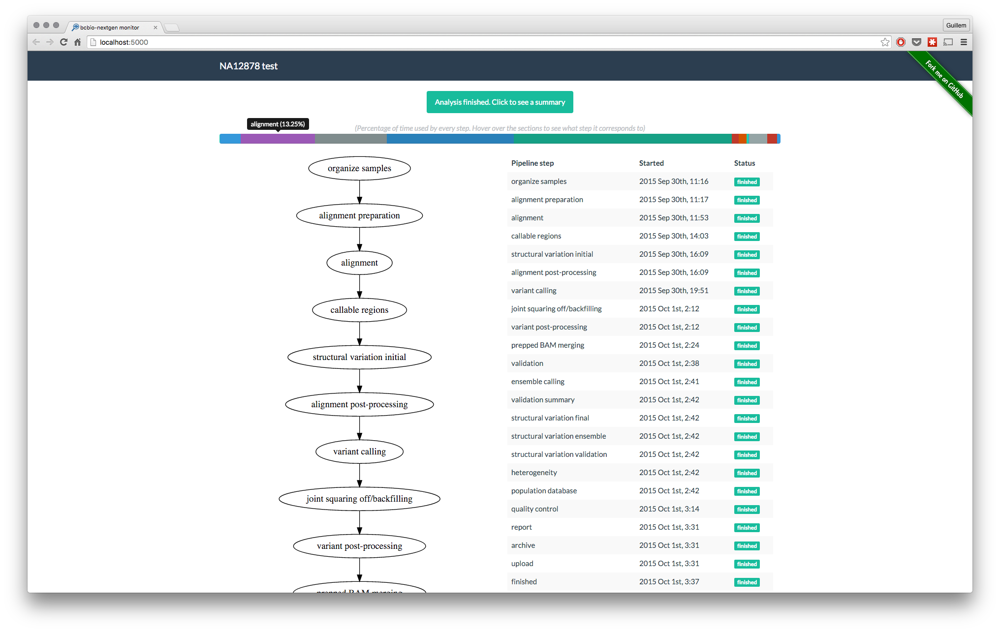
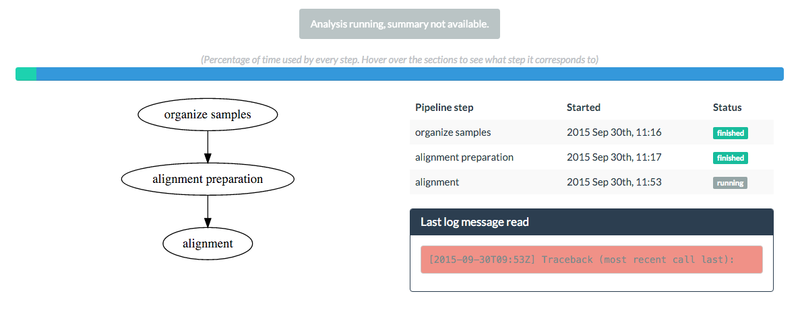
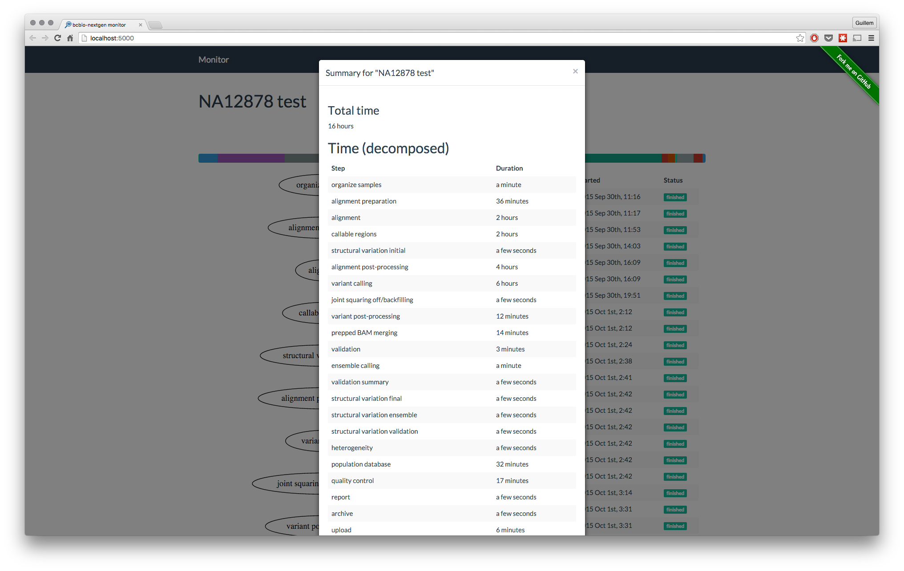

A typical genomics data analysis lasts usually for several hours or even days, depending on the type
of analysis performed. One common problem with these kind of analysis is that sometimes its hard, or
inconvenient at least, to know the current status of the analysis being performed. In most occasions
it involves SSH-ing to remote machines, looking for logs and GREP-ing through them.

[bcbio-nextgen][bcbio] is a python toolkit providing best-practice pipelines for fully automated high
throughput sequencing analysis.

<!--more-->

# The problem
As mentioned before, tracking long-run analyses is not always easy on these kind of workflows, and bcbio-nextgen
is not an exception. When running an analysis, the only way to know what's the status of it is by looking
into the logs. Wouldn't it be nice, and more convenient, to have a simple frontend layer that displayed
the progress of the current analysis?

# The solution
That's precisely what [bcbio-monitor][monitor] does. Now, to build a frontend for such a piece of software
like **bcbio-nextgen**, there are a couple of architectural **decisions** one needs to make. The very first
question that came to my mind was:

## Coupled or decoupled?
Do you want the tracker to be tighten to the software its tracking, in the sense of _requiring_ it to
function? You may think that's the logical choice at first, but think about this: bcbio-nextgen, as many
complex analysis pipelines has a lot of dependencies and its tricky to install. Even with [all the facilities][installation]
that [Brad Chapman][brad] gives us to install bcbio, still time and computational resources are needed
to install bcbio-nextgen. I thought that, to be a practical tool, the potential users should be able to
install the monitor real quick _on a personal computer_ and start tracking analyses wherever they're running them
(which is generally a remote HPC or Cloud environment).

Every programmer should know the [importance of good logging practices][logging] for any application, right? bcbio-nextgen
does this _really_ well. So I though that I could just use the information from the log that bcbio-nextgen
generates, instead of inserting tracking code in the pipeline itself. **This makes the monitor independent
from the pipeline**, making it possible to just read ongoing analyses log files to build a status graph,
or even read finished analyses logs to get a run summary.

## Updating the client (web frontend)
Having decided to use the log file, we need a way of updating the client application on every pipeline
step. There are mainly two options:

### Client-Server communication through polling
Though this would work perfectly fine, I wanted t avoid it mainly for two reasons

1. You have to define a polling interval yourself, which has to be sensitive given the update ratio of
the pipeline. Its not easy to decide for a sensitive interval since the duration of different steps goes
from seconds to hours.
2. Even deciding for a good enough polling interval, by definition, polling implies hundreds or thousands
of useless requests to the server.

### Server-Client communication through HTML5 SSE events
The ideal solution would be to update the client only when a new step has finished, or when some relevant
info (i.e an error in the analysis) needs to be presented to the user.

Doing some research I learned about [SSE protocol in HTML5][SSE], and so I decided to go for that.
SSE is precisely that: The client application subscribes to the server, who only has to publish messages that all subscribers will
read. The protocol is robust, and even it you kill bcbio-monitor, when starting it again it will reconnect
to the client.

With SSE, the client is updated only on important events, and no useless requests to the server are needed.

# bcbio-monitor: Features
Once the backend architecture was decided, the ""only"" thing remaining was to build the informative
frontend application. As of by version 1.0, this is how bcbio-monitor looks like:

**Progress flowchart and steps table**

The table on the right gives the user information about the finshed and running step, as well as timing
information readable by humans (thanks to [momentjs][moment]). The flowchart on the left is, to be honest,
not very informative _on this version_. The idea for the flowchart is to create branches for every computing
node where the current step is running.

**Percentage of time used by every step**

For quick visual reference of which steps take the longer time

**Error detection**

**Summary for the analysis**

At the end of the analysis, get a summary of the analysis. Same than with the flowchart, this will contain
more information in future versions.

# Final remarks
Lots of features could (and hopefully will) be added to bcbio-monitor, but this very first version
`1.0` is already a working prototype to track `bcbio-nextgen` analyses. I'm creating a series of issues
for version `1.1`, please feel free to add whatever you think could be useful :-).

[bcbio]: https://bcbio-nextgen.readthedocs.org/en/latest/
[monitor]: https://github.com/guillermo-carrasco/bcbio-nextgen-monitor
[installation]: https://bcbio-nextgen.readthedocs.org/en/latest/contents/installation.html
[brad]: https://github.com/chapmanb
[logging]: http://www.nsprogrammer.com/2013/06/logging-to-disk-most-important-part-of.html
[SSE][http://www.html5rocks.com/en/tutorials/eventsource/basics/]
[moment]: http://momentjs.com/
[issues]: https://github.com/guillermo-carrasco/bcbio-nextgen-monitor/issues
